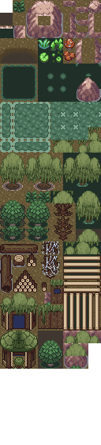

# About `pokeemerald-expansion`

  

<!-- If you want to re-record or change these gifs, here are some notes that I used: https://files.catbox.moe/05001g.md -->

**`pokeemerald-expansion`** is a GBA ROM hack base that equips developers with a comprehensive toolkit for creating Pokémon ROM hacks. **`pokeemerald-expansion`** is built on top of [pret's `pokeemerald`](https://github.com/pret/pokeemerald) decompilation project. **It is not a playable Pokémon game on its own.**

# [Features](FEATURES.md)

**`pokeemerald-expansion`** offers hundreds of features from various [core series Pokémon games](https://bulbapedia.bulbagarden.net/wiki/Core_series), along with popular quality-of-life enhancements designed to streamline development and improve the player experience. A full list of those features can be found in [`FEATURES.md`](FEATURES.md).

# [Credits](CREDITS.md)

 [](CREDITS.md)

If you use **`pokeemerald-expansion`**, please credit **RHH (Rom Hacking Hideout)**. Optionally, include the version number for clarity.

```
Based off RHH's pokeemerald-expansion 1.15.0 https://github.com/rh-hideout/pokeemerald-expansion/
```

Please consider [crediting all contributors](CREDITS.md) involved in the project!

# Choosing `pokeemerald` or **`pokeemerald-expansion`**

- **`pokeemerald-expansion`** supports multiplayer functionality with other games built on **`pokeemerald-expansion`**. It is not compatible with official Pokémon games.
- If compatibility with official games is important, use [`pokeemerald`](https://github.com/pret/pokeemerald). Otherwise, we recommend using **`pokeemerald-expansion`**.
- **`pokeemerald-expansion`** incorporates regular updates from `pokeemerald`, including bug fixes and documentation improvements.

# [Getting Started](INSTALL.md)

❗❗ **Important**: Do not use GitHub's "Download Zip" option as it will not include commit history. This is necessary if you want to update or merge other feature branches.

If you're new to git and GitHub, [Team Aqua's Asset Repo](https://github.com/Pawkkie/Team-Aquas-Asset-Repo/) has a [guide to forking and cloning the repository](https://github.com/Pawkkie/Team-Aquas-Asset-Repo/wiki/The-Basics-of-GitHub). Then you can follow one of the following guides:

## 📥 [Installing **`pokeemerald-expansion`**](INSTALL.md)
## 🏗️ [Building **`pokeemerald-expansion`**](INSTALL.md#Building-pokeemerald-expansion)
## 🚚 [Migrating from **`pokeemerald`**](INSTALL.md#Migrating-from-pokeemerald)
## 🚀 [Updating **`pokeemerald-expansion`**](INSTALL.md#Updating-pokeemerald-expansion)

# [Documentation](https://rh-hideout.github.io/pokeemerald-expansion/)

For detailed documentation, visit the [pokeemerald-expansion documentation page](https://rh-hideout.github.io/pokeemerald-expansion/).

# [Contributions](CONTRIBUTING.md)
If you are looking to [report a bug](CONTRIBUTING.md#Bug-Report), [open a pull request](CONTRIBUTING.md#Pull-Requests), or [request a feature](CONTRIBUTING.md#Feature-Request), our [`CONTRIBUTING.md`](CONTRIBUTING.md) has guides for each.

# [Community](https://discord.gg/6CzjAG6GZk)

[](https://discord.gg/6CzjAG6GZk)

Our community uses the [ROM Hacking Hideout (RHH) Discord server](https://discord.gg/6CzjAG6GZk) to communicate and organize. Most of our discussions take place there, and we welcome anybody to join us!

# Maps and Tilesets for pokeemerald-expansion

A collection of ready-to-use maps and tilesets for the [pokeemerald-expansion](https://github.com/rh-hideout/pokeemerald-expansion) codebase. Based off RHH's pokeemerald-expansion 1.15.0.

Each map is developed on its own branch so you can pick and choose what to merge into your project.

> Note: In addition to hand-writing it, AI has been used to generate documentation & code used for these features.

## How to Use

Each map lives on its own branch under `feature/maps-and-tilesets/`, alternatively this branch (`feature/maps-and-tilesets/all`) includes all:

| Branch | Description |
|--------|-------------|
| `feature/maps-and-tilesets/main` | Base branch (shared foundation) |
| `feature/maps-and-tilesets/` | All tilesets |
| `feature/maps-and-tilesets/prairie` | Prairie tileset and maps |
| `feature/maps-and-tilesets/swamp` | Swamp tileset and maps |

To add a map to your project, merge the relevant branch:

```bash
git remote add maps-and-tilesets <this-repo-url>
git fetch maps-and-tilesets
git merge maps-and-tilesets/feature/maps-and-tilesets/prairie
git merge maps-and-tilesets/feature/maps-and-tilesets/swamp
```

(note: merging multiple tilesets individually will likely result in simple merge errors to resolve)

## How to Modify

Tilesets are compiled using [Porytiles](https://github.com/grunt-lucas/porytiles) using the included raw files (e.g. raw-tilesets/swamp/top.png, or the Aseprite file raw-tilesets/swamp/tilesetase.aseprite). See [notes/porytiles.md](notes/porytiles.md) for setup instructions and the **Workflow** section for the edit-compile-reload cycle.

## Maps

These maps use **triple layer metatiles**. Follow the instructions at [Triple Layer Metatiles](https://github.com/pret/pokeemerald/wiki/Triple-layer-metatiles) to set this up in your project before merging.

### Prairie

A prairie/savanna/desert mesa featuring custom tiles, wild encounters, trainers, and item pickups. Includes two example maps:

- **Prairie**
- **Prairie2**

**Tileset:**


**Prairie2 Map:**


See [raw_tilesets/prairie/credits.md](raw_tilesets/prairie/credits.md) for tileset credits.

### Swamp

A murky swamp featuring custom tiles with animated water, lilypads, and swaying plants. Includes wild encounters and two example maps:

- **Swamp1**
- **Swamp2**

**Tileset:**



**Swamp Map:**


**Animations:**
- Puddle water ripples
- Lilypad bobbing
- Swamp plant/tall grass swaying
